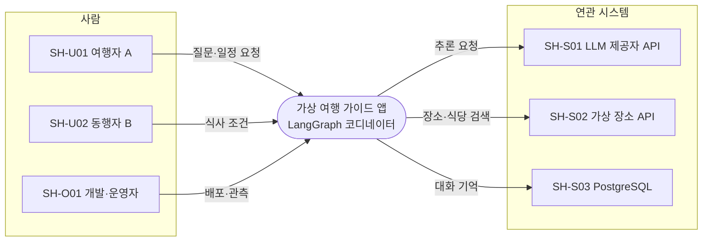

# 시스템 컨텍스트 뷰 (의도 뷰, C4 Level 1)

누구의 어떤 질문: 모든 이해관계자 — 이 시스템은 누구·무엇과 맞닿는가?

상자 하나가 [이해관계자 정의서](../stakeholders.md)의 행 하나입니다.

```mermaid
flowchart LR
    subgraph 사람
        U01["SH-U01 여행자 A"]
        U02["SH-U02 동행자 B"]
        O01["SH-O01 개발·운영자"]
    end
    SYS(["가상 여행 가이드 앱<br/>LangGraph 코디네이터"])
    subgraph 연관시스템["연관 시스템"]
        S01["SH-S01 LLM 제공자 API"]
        S02["SH-S02 가상 장소 API"]
        S03["SH-S03 PostgreSQL"]
    end
    U01 -- "질문·일정 요청" --> SYS
    U02 -- "식사 조건" --> SYS
    O01 -- "배포·관측" --> SYS
    SYS -- "추론 요청" --> S01
    SYS -- "장소·식당 검색" --> S02
    SYS -- "대화 기억" --> S03
```
