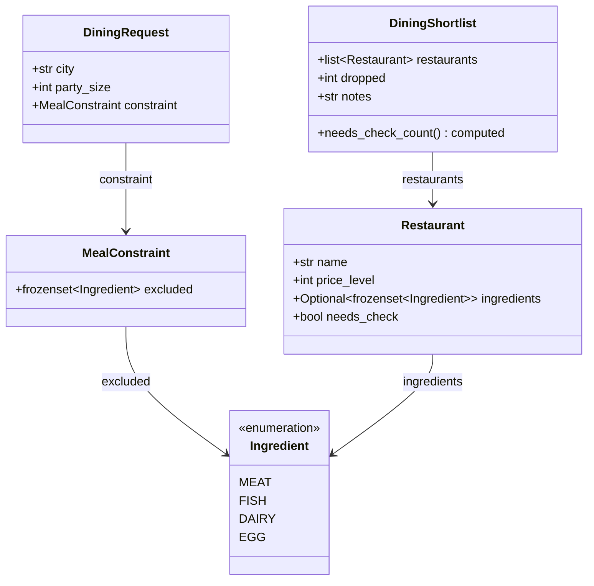

<!-- 생성된 파일입니다. 손으로 고치지 마세요. 다시 만들기: python scripts/gen_views.py -->
# 계약 클래스 뷰 (사실 뷰)

누구의 어떤 질문: 계약 승인자 — 모듈 경계를 넘는 데이터는 어떤 모양이고 무엇을 참조하는가?

```mermaid
classDiagram
    class DiningRequest {
        +str city
        +int party_size
        +MealConstraint constraint
    }
    class DiningShortlist {
        +list~Restaurant~ restaurants
        +int dropped
        +str notes
        +needs_check_count() computed
    }
    class MealConstraint {
        +frozenset~Ingredient~ excluded
    }
    class Restaurant {
        +str name
        +int price_level
        +Optional~frozenset~Ingredient~~ ingredients
        +bool needs_check
    }
    class Ingredient {
        <<enumeration>>
        MEAT
        FISH
        DAIRY
        EGG
    }
    DiningRequest --> MealConstraint : constraint
    DiningShortlist --> Restaurant : restaurants
    MealConstraint --> Ingredient : excluded
    Restaurant --> Ingredient : ingredients
```
